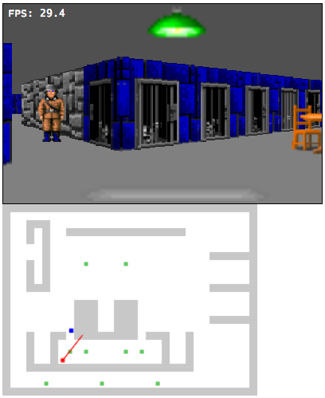
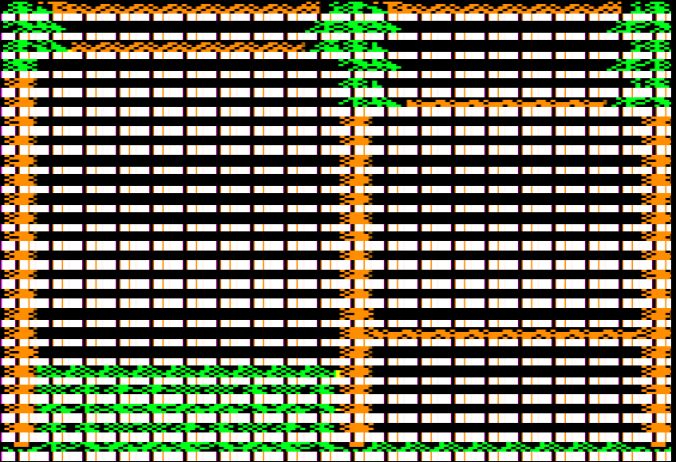

The Tale of Big Blue
====================

Part 1: Outlaw Editor
---------------------

*Hey!* Check out the video screencast of part 1: http://screencast.com/t/ZnRNXVLGi

I'm Martin Haye, and I'm gonnaa to tell you the story of a pixel called Big Blue, and his journey from Seth's mind to an Apple II screen. Along the way we'll be taking a detailed tour of the code and data behind the scenes so you can get a feel for how it all works.

[TODO: back-fill text and links] TK

Part 2: Casting Rays
--------------------

*Hey!* Check out the video screencast of part 2: http://screencast.com/t/NNLVxjHZH5

Last time we covered Big Blue's childhood, springing from Seth's mind into Outlaw Editor and then being converted to bits in a file. Now we'll take a detour to introduce ray casting, a critical influence in Blue's life.

You see, before Big Blue can make his debut on the Apple II screen, we need to know where on that screen he should appear. We know he's part of a window on a certain building in the town, but he should only show on the screen when the player is looking at that building. To figure that out I'm afraid we're going to need math but I promise I'll keep it light.

http://dev.opera.com/articles/view/creating-pseudo-3d-games-with-html-5-can-1/

We use a method called Ray Casting; it's seen in tons of first-person shooter games like Wolf 3D for the Apple IIgs. In fact we started with some Javascript code that simulates the look of Wolf 3D and even uses the same textures. 

 
http://devfiles.myopera.com/articles/650/step_4_enemies.htm

That code was a good starting point because it's easy and fun to play with because you can see the results immediately in a browser. However, the math uses lots of sin and cosin and sqrt which are slow on an Apple II, so I found and substituted more efficient math from a different raycasting tutorial I found:

http://lodev.org/cgtutor/raycasting.html

The basic idea is that shoot a bunch of virtual "rays" from the player's eye in each direction they can see. We start with rays pointing to the left, then rays closer to the center, then rays pointing to the right; what a ray hits tells us how to draw a tall thin column of pixels: what to draw (based on what kind of wall the ray hit and where on that wall it struck), and how big -- based on the distance (close things are big, far things are small).

Let's take a brief look at the code to do this. This is written in Javascript, making it easy to test changes to it before porting them to the Apple II.

The player has a position, X and Y, and a direction, shown in the code marked [BigBlue2a](https://github.com/badvision/lawless-legends/search?q=BigBlue2a).

```javascript
// Player attributes [ref BigBlue2a]
var player = {
  x : 11.0,      // current x, y position
  y : 10.5,
  dir : 0,    // the direction that the player is turning, either -1 for left or 1 for right.
```

For efficiency we perform as much math as possible at startup and stick the results into tables, that's done here. Lots of trigonometric functions and square roots so it's good to do this once instead of each time we have to draw the screen. You don't have to understand the math, this is just so you can get a feel for where it is and what it looks like. [BigBlue2b](https://github.com/badvision/lawless-legends/search?q=BigBlue2b)

```javascript
// Set up data tables prior to rendering [ref BigBlue2b]
function initCast() 
{
  var i;
  
  console.log("Initializing cast data.");
  precastData = [];
```

When you press a key, like to move forward, this code gets called and decides that to do, like update the player's X/Y coordinate or direction. [BigBlue2c](https://github.com/badvision/lawless-legends/search?q=BigBlue2c)

```javascript
    switch (e.keyCode) { // which key was pressed? [ref BigBlue2c]

      case 38: // up, move player forward, ie. increase speed
        player.speed = 1;
```

Then this code cycles through each ray and draws it. [BigBlue2d](https://github.com/badvision/lawless-legends/search?q=BigBlue2d)

```javascript
// Cast all the rays from the player position and draw them [ref BigBlue2d]
function castRays(force) 
{
  // If we're already showing this location and angle, no need to re-do it.
  if (!force && 
      player.x == prevX && 
```

The complicated math is handled in a separate function. This code traces an individual ray from the player's eye until it hits something on the map. [BigBlue2e](https://github.com/badvision/lawless-legends/search?q=BigBlue2e)

```javascript
// Cast one ray from the player's position through the map until we hit a wall.
// [ref BigBlue2e]
// This version uses only integers, making it easier to port to the 6502.
function intCast(x)
{
  // Start with precalculated data for this ray direction
  var data = precastData[player.angleNum][x];
  
  // Calculate ray position and direction 
  var wRayPosX = sword(player.x * 256);
```

The results of all this math for a given horizontal coordinate are: (1) the wall type, the coordinate left-to-right on that wall's texture, and the height of the column to draw. [BigBlue2f](https://github.com/badvision/lawless-legends/search?q=BigBlue2f)

```javascript
  // Wrap it all in a nice package. [ref BigBlue2f]
  return { wallType: map[bMapY][bMapX], 
           textureX: bWallX / 256.0,
           height:   lineHeight };
```

Next time we'll see this code on the Apple II, and take a look at how the results get drawn on the hi-res graphics screen.


Part 3: ...and calc! and blend! and calc!
-----------------------------------------

*Hey!* Check out the video screencast of part 3: TK

Let's do some pixel calisthenics! In part 3 we're going to see how all that ray-casting logic works on the Apple II, and then delve into the mysteries of blending color pixels onto the hi-res screen. The final part next time will cover the secret sauce, fast scaling of Big Blue's texture image to the proper size.

So I showed you a bunch of ray casting code in Javascript. Let's take a quick look at the 6502 assembly language code that does the same stuff. You don't have to understand it all, but it's good to know where it is and roughly what it does.

First, we set up the player's position and direction. We store each coordinate in two bytes: the low byte is the fractional part (0..255, so $80 = 128 = 0.5), and the high byte is the whole part (1, 2, etc.).
[BigBlue3_10](https://github.com/badvision/lawless-legends/search?q=BigBlue3_10)

```Assembly
; Establish the initial player position and direction [ref BigBlue3_10]
setPlayerPos:
    ; X=1.5
    lda #1
    sta playerX+1
    lda #$80
    sta playerX
    ; Y=2.5
    lda #2
    sta playerY+1
    lda #$80
    sta playerY
    ; direction=0
    lda #0
    sta playerDir
    rts
```

Remember those logarithm tables we created in the Javascript code? And the table of vectors for each possible angle? They're just encoded directly here rather than computed on the 6502. [BigBlue3_20](https://github.com/badvision/lawless-legends/search?q=BigBlue3_20)

```Assembly
; Table to translate an unsigned byte to 3+5 bit fixed point log2 [ref BigBlue3_20]
tbl_log2_b_b:
    .byte $00,$00,$00,$00,$00,$07,$0C,$11,$15,$19,$1C,$1F,$22,$24,$27,$29
    .byte $2B,$2D,$2E,$30,$32,$33,$34,$36,$37,$38,$3A,$3B,$3C,$3D,$3E,$3F
    .byte $40,$41,$42,$43,$44,$44,$45,$46,$47,$48,$48,$49,$4A,$4A,$4B,$4C
    ;...etc...
```

[BigBlue3_30](https://github.com/badvision/lawless-legends/search?q=BigBlue3_30)

```Assembly
; Precalculated ray initialization parameters. One table for each of the 16 angles.
; Each angle has 63 rays, and each ray is provided with 4 parameters (one byte each param):
; dirX, dirY, deltaX, deltaY. [ref BigBlue3_30]
precast_0:
    .byte $72,$C7,$3E,$7C
    .byte $72,$C9,$3D,$7E
    .byte $72,$CB,$2C,$5E
    .byte $72,$CD,$39,$7E
    ;...etc...
precast_1:
    .byte $7F,$F7,$09,$7F
    .byte $7E,$F9,$05,$56
    .byte $7E,$FA,$05,$6F
    .byte $7D,$FC,$04,$7D
    ;...etc...
```

Here's the code to process a keypress from the player. [BigBlue3_40](https://github.com/badvision/lawless-legends/search?q=BigBlue3_40)

```Assembly
    ; Dispatch the keypress [ref BigBlue3_40]
:   cmp #'W'            ; 'W' for forward
    bne :+
    jsr moveForward
    jmp @nextFrame
:   cmp #'X'            ; 'X' alternative for 'S'
    bne :+
    lda #'S'
:   cmp #'S'            ; 'S' for backward
    bne :+
    jsr moveBackward
    jmp @nextFrame
:   cmp #'A'            ; 'A' for left
    bne :+
    ; ...etc...
```

When we need to re-draw, this code steps through each ray, calculating the texture number, coordinate, and height, then drawing it. 
[BigBlue3_50](https://github.com/badvision/lawless-legends/search?q=BigBlue3_50)

```Assembly
    ; Calculate the height, texture number, and texture column for one ray
    ; [ref BigBlue3_50]
@oneCol:
    stx pMap            ; set initial map pointer for the ray
    sty pMap+1
    phy                 ; save map row ptr
    phx
    pha                 ; save ray offset
    tay                 ; ray offset where it needs to be
    jsr castRay         ; cast the ray across the map
    lda pixNum
    bne :+
    jsr clearBlit       ; clear blit on the first pixel
:   jsr drawRay         ; and draw the ray
```

And finally there's a whole bunch of code that does all that complicated math we don't understand. I'm not going to explain all the code in depth, other than to say it does the same thing the Javascript code did... just using a lot more lines!
[BigBlue3_60](https://github.com/badvision/lawless-legends/search?q=BigBlue3_60)

```Assembly
;-------------------------------------------------------------------------------
; Cast a ray  [ref BigBlue3_60]
; Input: pRayData, plus Y reg: precalculated ray data (4 bytes)
;        playerX, playerY (integral and fractional bytes of course)
;        pMap: pointer to current row on the map (mapBase + playerY{>}*height)
; Output: lineCt - height to draw in double-lines
;         txColumn - column in the texture to draw
castRay:
    ; First, grab the precalculated ray data from the table.
    ldx #1              ; default X step: forward one column of the map
    lda (pRayData),y    ; rayDirX
    ; ...and lots more code after this...
```

Okay, we're done covering ground we've seen before. Let's move on to a weighty subject: getting pixels on the screen. The Apple II's hi-res graphics memory is organized very strangely. The easy part is that each line is 40 consecutive bytes. However, the address for line 2 is not right after the address for line 1, and in general a weird formula is required to determine the starting address of a line.

| Line number | Start Address | End Address |
| ----------- | ------------- | ----------- |
| 0           | $2000         | $2027       |
| 1           | $2400         | $2427       |
| 2           | $2800         | $2827       |
| 3           | $2C00         | $2C27       |
| ...         | ...           | ...         |
| 8           | $2080         | $20A7       |
| 3           | $2180         | $21A7       |

It gets even weirder. Each byte stores 7 black-and-white pixels. What about color? In color mode each *pair* of pixels is taken in turn to mean a single color pixel. That means each byte stores *three and a half* pixels! Sounds crazy, yes? Sounds like it would lead to a very complicated program, and make it very time-consuming to put one pixel onto the screen.

You may have watched an image being loaded onto the Apple II hi-res screen. You'll have noticed that it loads in bands -- that's due to the weirdness we're talking about.

 

We don't want weird and complex, we need simple and fast. So our we throw some smarts at the problem to isolate all the complexity to a small part of our program, so the rest of the program doesn't have to worry about it. We use a technique called "unrolling". That's a little program that writes a big repetetive program into memory. In our case the unrolled routine has a block of code for every line on the screen, and each block contains an instruction or two for each kind of bit pair on that line. Code outside simply sticks the pixels in very regular and easy-to-calculate places, then calls the unrolled loop to blast everything onto the screen at high speed. In programming circles we call that blasting process a "bit blit" (stands for Bit-Level Block Transfer).

Here's the template for one block of the blit. This template gets copied and repeated for each line on the screen, substituting different addresses for the screen lines. [BigBlue3_70](https://github.com/badvision/lawless-legends/search?q=BigBlue3_70)

```Assembly
; Template for blitting code [ref BigBlue3_70]
blitTemplate: ; comments show byte offset
    lda decodeTo57 ;  0: pixel 3
    asl ;  3: save half of pix 3 in carry
    ora decodeTo01 ;  4: pixel 0
    ora decodeTo23 ;  7: pixel 1
    ora decodeTo45 ; 10: pixel 2
    sta (0),y ; 13: even column
    iny ; 15: prep for odd
    lda decodeTo01b ; 16: pixel 4
    ora decodeTo23b ; 19: pixel 5
    rol ; 22: recover half of pix 3
    ora decodeTo56 ; 23: pixel 6 - after rol to ensure right hi bit
    sta (0),y ; 26: odd column
    dey ; 28: prep for even
    ; 29 bytes total
```

All those ``lda`` and ``ora`` instructions are actually performing table lookups. The tables are aligned so that the low byte of the address is the actual value to look up.

So as you can see, the code takes 7 color pixels from separate bytes and, using these fancy table lookups to quickly shift the bits into their proper place, combines them with binary math into 2 output bytes. 

The next block will be the same as the first, but instead of ``sta (0),y`` we'll use ``sta (2),y``. And so on for the third block. Then just before calling the blit for the first time, we have code that puts all the screen line addresses into locations 0, 2, 4, etc. so the blitting code will store to the right places on the screen.

Here's what it the actual unrolled code looks like when we disassemble it on an Apple II after doing some rendering:

```Assembly
B000-   AD 11 AD    LDA   $AD11
B003-   0A          ASL
B004-   0D 11 A7    ORA   $A711
B007-   0D 11 A9    ORA   $A922
B00A-   0D 11 AB    ORA   $AB22
B00D-   91 00       STA   ($00),Y
B00F-   C8          INY
B010-   AD 11 A8    LDA   $A811
B013-   0D 11 AA    ORA   $AA22
B016-   2A          ROL
B017-   0D 11 AC    ORA   $AC11
B01A-   91 00       STA   ($00),Y
B01C-   88          DEY
B01D-   AD 11 AD    LDA   $AD11
B020-   0A          ASL
B021-   0D 11 A7    ORA   $A711
B024-   0D 11 A9    ORA   $A922
B027-   0D 11 AB    ORA   $AB22
B02A-   91 02       STA   ($02),Y
B02C-   C8          INY
B02D-   AD 11 A8    LDA   $A811
B030-   0D 11 AA    ORA   $AA01
B033-   2A          ROL
B034-   0D 11 AC    ORA   $AC11
B037-   91 02       STA   ($02),Y
B039-   88          DEY
B03A-   AD 11 AD    LDA   $AD30
B03D-   0A          ASL
B03E-   0D 11 A7    ORA   $A711
B041-   0D 11 A9    ORA   $A911
B044-   0D 11 AB    ORA   $AB12
B047-   91 04       STA   ($04),Y
B049-   C8          INY
B04A-   AD 11 A8    LDA   $A830
B04D-   0D 11 AA    ORA   $AA32
B050-   2A          ROL
B051-   0D 11 AC    ORA   $AC22
B054-   91 04       STA   ($04),Y
B056-   88          DEY
B057-   AD 11 AD    LDA   $AD11
...
```

See all those 11's, 22's and other numbers at the end of these lines? Believe it or not those are actual pixel values! Originally in the template they were 00. So some code somewhere has filled them in. What code? We'll fill in that last missing piece next time, when we talk about texture scaling in the final chapter of Big Blue's biography.
