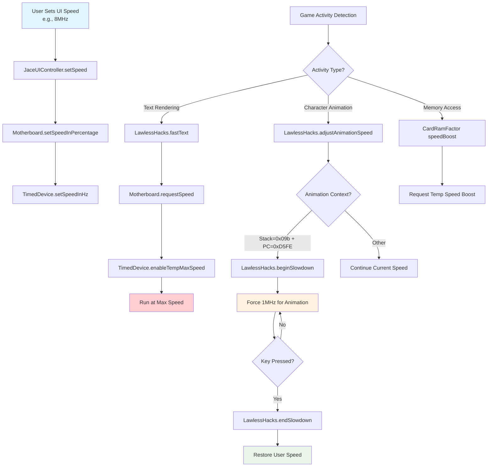
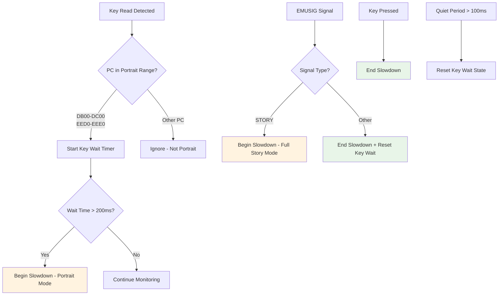
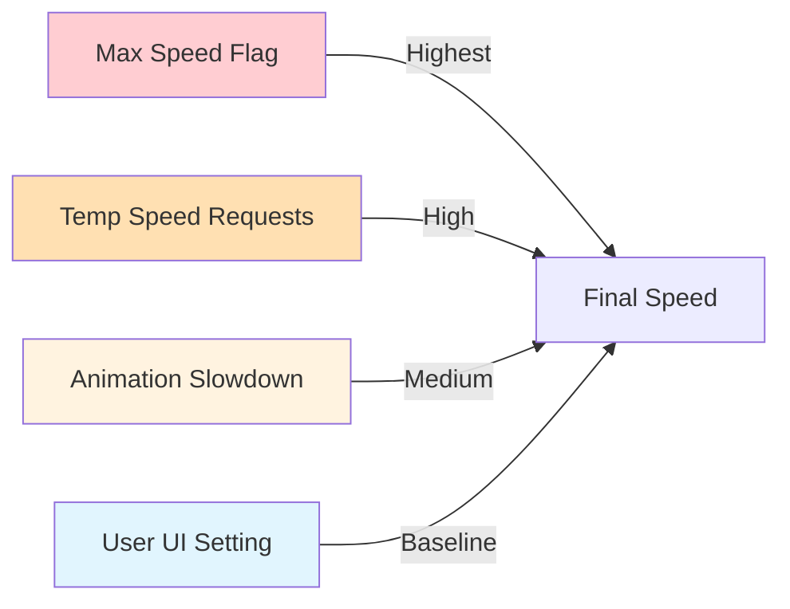
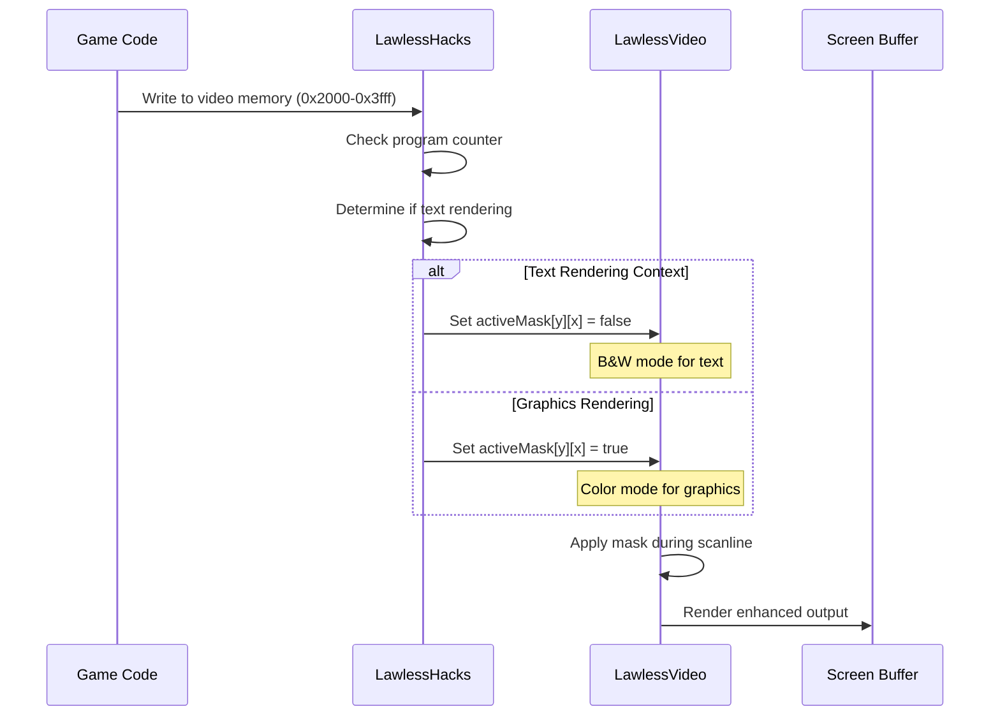
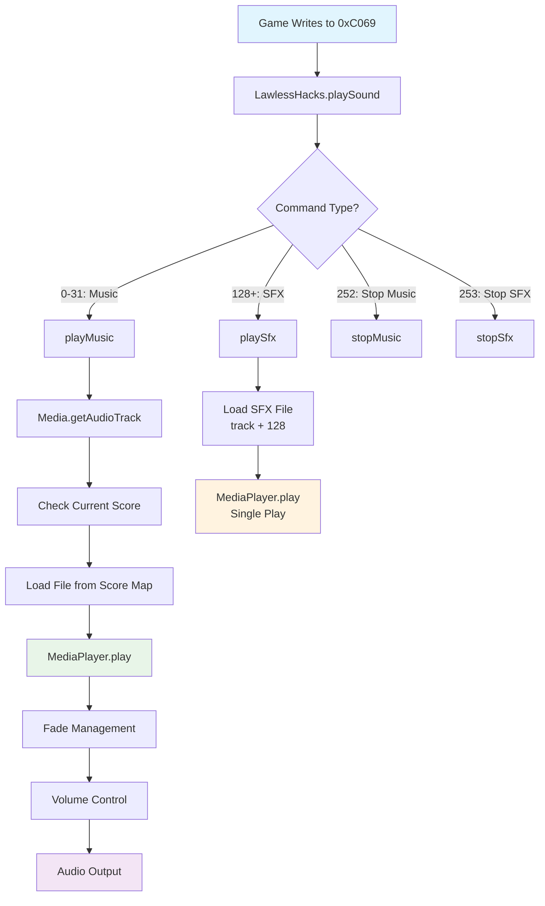

# Lawless Legends Systems Documentation

This document explains the custom systems implemented specifically for Lawless Legends gameplay optimization and enhancement.

## Speed Control System

The Lawless Legends emulator implements a sophisticated speed control system that balances performance optimization with gameplay authenticity.

### Speed Control Flow



### EMUSIG Communication System

The game engine communicates its current mode to the emulator via **EMUSIG** (Emulator Signal) constants:

| Address | Constant | Purpose | Speed Behavior |
|---------|----------|---------|----------------|
| 0xC049 | EMUSIG_FULL_COLOR | Title screen | Normal |
| 0xC04A | EMUSIG_FULL_TEXT | Inventory/menus | Normal |
| 0xC04B | EMUSIG_2D_MAP | Wilderness | Normal |
| 0xC04C | EMUSIG_3D_MAP | Towns/dungeons | Normal |
| 0xC04D | EMUSIG_AUTOMAP | Automap display | Normal |
| 0xC04E | EMUSIG_STORY | **Portrait/story mode** | **1MHz** |
| 0xC04F | EMUSIG_TITLE | Title menu area | Normal |

When the game writes to any EMUSIG address, the emulator knows the current display context and can adjust behavior accordingly, except that determining when we're in a "portrait animation" is rather tricky as it doesn't have its own flag presently.  However, when a portrait is done displaying the EMUSIG mode corresponding to what we were doing previously is triggered, signaling we are out of portrait mode.

### Hybrid Portrait Detection Algorithm

The system uses a multi-layered approach to detect portrait dialogues:



#### Detection Logic Flow

1. **PC-Based Key Read Detection**: Monitor keyboard reads with specific program counter ranges:
   - **0xDB00-0xDC00**: Primary portrait dialogue routine
   - **0xEED0-0xEEE0**: Secondary portrait routine
   - Other PC addresses are ignored to avoid false positives
2. **Timer Analysis**: If portrait PC key waiting exceeds 200ms → begin slowdown
3. **EMUSIG Confirmation**: Mode changes confirm portrait end
4. **User Input**: Key press immediately exits slowdown
5. **Timeout Reset**: 100ms quiet period resets detection state

This approach combines:
- **Precise PC analysis** (specific code addresses for portrait routines)
- **Timing patterns** (portrait dialogues have characteristic wait times)
- **Official signals** (EMUSIG provides reliable mode transitions)
- **User behavior** (key presses indicate interaction completion)

#### EMUSIG Debugging

To debug EMUSIG mode changes, set `DEBUG = true` in `LawlessHacks.java`. This will log all mode transitions:

```
EMUSIG: 3D_MAP (0xC04C)
Exiting portrait mode - restoring normal speed
EMUSIG: STORY (0xC04E)  
Entering portrait mode - slowing to 1MHz
```

### Speed Control Components

#### 1. UI Speed Setting
- **Location**: `JaceUIController.setSpeed()`
- **Purpose**: Sets the baseline speed that the user desires
- **Range**: 0.5x (half speed) to ∞ (max speed)
- **Implementation**: Converts UI slider value to percentage and calls `setSpeedInPercentage()`

#### 2. Text Rendering Speed Boost
- **Location**: `LawlessHacks.fastText()`
- **Trigger**: Execution in memory range `0x0ee00` to `0x0f0c0`
- **Purpose**: Accelerates text rendering for better user experience
- **Mechanism**: Uses temporary speed requests to motherboard
- **Duration**: Active only during text rendering operations

#### 3. Animation Speed Control
- **Location**: `LawlessHacks.handleModeChange()` + `LawlessHacks.detectKeyWaiting()`
- **Detection Method**: Hybrid approach combining multiple signals:
  - `EMUSIG_STORY` (0xC04E) = Full-screen story mode (1MHz)
  - Key read patterns = Portrait dialogue detection
  - EMUSIG mode changes = Portrait end detection
  - Time-based heuristics = Portrait duration analysis
- **Purpose**: Slows character animations to 1MHz to prevent comical speed
- **Reliability**: Multi-layered detection, more robust than single-method approaches

#### 4. Memory Access Speed Boost
- **Location**: `CardRamFactor.speedBoost`
- **Purpose**: Accelerates when accessing RAM expansion cards
- **Configuration**: Optional, disabled by default

### Speed Priority System



1. **Max Speed Flag**: Overrides everything (∞ speed)
2. **Temporary Speed Requests**: Text rendering, memory access boosts
3. **Animation Slowdown**: Forces 1MHz during character animations
4. **User UI Setting**: Baseline speed when no overrides are active

### Timing Drift Protection

The system includes protection against timing drift during max speed periods:

- **Problem**: During max speed, `nextSync` could drift far into the future
- **Solution**: Cap maximum drift to 50ms using `MAX_TIMER_DELAY_MS`
- **Location**: `TimedDevice.calculateResyncDelay()`
- **Effect**: Prevents multi-second pauses when transitioning from max speed to normal speed

## Video Rendering Enhancement System

The Lawless Legends video system enhances text readability through selective black & white rendering.

### Video Enhancement Flow



### Video Enhancement Components

#### 1. Text Detection
- **Location**: `LawlessHacks.enhanceText()`
- **Trigger**: Memory writes to video RAM (`0x2000-0x3fff`)
- **Detection Logic**:
  ```java
  boolean drawingText = (pc >= 0x0ee00 && pc <= 0x0f0c0 && pc != 0x0f005) || pc > 0x0f100;
  ```

#### 2. Mask Application
- **Location**: `LawlessVideo.activeMask[][]`
- **Structure**: 192 rows × 80 columns boolean array
- **Purpose**: Controls color vs. B&W rendering per pixel pair
- **Default**: All pixels set to color mode (`true`)

#### 3. Rendering Process
- **Location**: `LawlessVideo.hblankStart()`
- **Process**:
  1. Copy row's mask to `colorActive[]`
  2. Call parent rendering with mask applied
  3. Parent renderer uses mask to determine color vs. B&W per pixel

### Text Enhancement Benefits

- **Improved Readability**: Text appears in crisp black & white
- **Preserved Graphics**: Game graphics remain in full color
- **Automatic Detection**: No manual mode switching required
- **Performance**: Minimal overhead during rendering

## Audio System

The Lawless Legends audio system provides dynamic music and sound effects with multiple soundtrack options.

### Audio System Architecture



### Audio Trigger System

#### 1. Memory-Mapped Audio Control
- **Trigger Address**: `0x0C069` (SFX_TRIGGER)
- **Detection**: Memory write events to this address
- **Handler**: `LawlessHacks.playSound(int value)`

#### 2. Command Interpretation
```java
if (value <= 31) {
    // Music tracks (0-31)
    playMusic(value, false);
} else if (value >= 128) {
    // Sound effects (128+)
    playSfx(value - 128);
} else if (value == 252) {
    stopMusic();
} else if (value == 253) {
    stopSfx();
}
```

### Soundtrack System

#### File Structure
```
/jace/data/sound/
├── scores.txt              # Soundtrack definitions
├── common/                 # Common soundtrack files
│   ├── 01_title.ogg
│   ├── 02_town.ogg
│   └── ...
├── 8-bit-orchestral-samples/  # Orchestral soundtrack
│   ├── 01_title.ogg
│   ├── 02_town.ogg
│   └── ...
└── 8-bit-chipmusic/          # Chiptune soundtrack
    ├── 01_title.ogg
    ├── 02_town.ogg
    └── ...
```

#### Scores Configuration Format
```
# Soundtrack name (lowercase, used as directory)
8-bit orchestral samples

# Track mapping: number filename
1 01_title.ogg
2 02_town.ogg
17* 17_battle.ogg    # * indicates auto-resume track
...

# Another soundtrack
8-bit chipmusic
1 01_title_chip.ogg
2 02_town_chip.ogg
...
```

### Audio Features

#### 1. Multiple Soundtrack Support
- **Selection**: Runtime switching between soundtracks
- **Mapping**: Each soundtrack maps track numbers to different files
- **Fallback**: Graceful handling of missing files

#### 2. Fade Effects
- **Fade In**: New tracks fade in over 1.5 seconds
- **Fade Out**: Smooth transitions between tracks
- **Volume Control**: Separate music and SFX volume controls

#### 3. Auto-Resume System
- **Marked Tracks**: Tracks with `*` in scores.txt resume from last position
- **Time Tracking**: System remembers playback position
- **Context Awareness**: Battle music and story tracks auto-resume

#### 4. Sound Effects
- **File Mapping**: SFX use same numbering + 128 offset
- **Independent Playback**: SFX don't interfere with music
- **Single Play**: SFX play once and stop

### Audio Implementation Details

#### Media Loading
```java
public Media getAudioTrack(int number) {
    String filename = getSongName(number);  // Lookup in current score
    String pathStr = "/jace/data/sound/" + filename;
    return new Media(pathStr);
}
```

#### Volume Control
- **Music Volume**: Controlled via `setMusicVolume(0.0-1.0)`
- **SFX Volume**: Controlled via speaker volume scaling
- **UI Integration**: Sliders in control overlay

#### Performance Considerations
- **Threaded Playback**: Audio operations run in separate threads
- **Resource Management**: Proper cleanup of MediaPlayer objects
- **Error Handling**: Graceful fallback for missing audio files

## System Integration

All these systems work together to provide an enhanced Lawless Legends experience:

1. **Speed Control** ensures smooth gameplay with appropriate speeds for different contexts
2. **Video Enhancement** improves text readability without affecting graphics
3. **Audio System** provides immersive soundscapes with multiple soundtrack options

The systems are designed to be:
- **Non-intrusive**: Enhance without breaking original gameplay
- **Configurable**: Allow user control over enhancements
- **Robust**: Handle edge cases and errors gracefully
- **Performance-conscious**: Minimize impact on emulation speed 